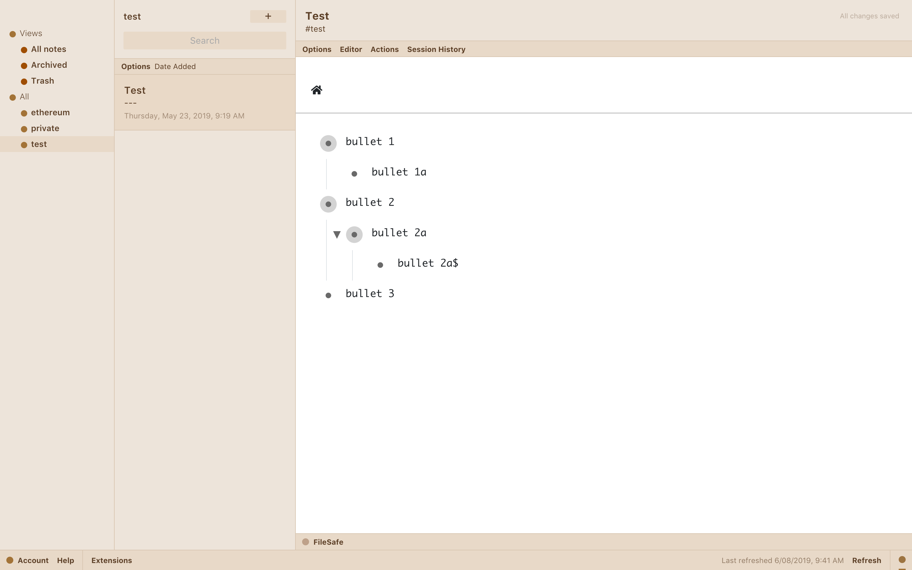

# README.MD

#### How to add outline-editor extension to StandardNotes

1. Run the app in development mode using:
   `$ npm start`

2. Open StandardNotes and click "Extension" > "Import Extension"

3. Type the following link into the url bar:
    [http://localhost:3000/ext.json](http://localhost:3000/ext.json)

4. Press enter to import the extension into StandardNotes

// This project was bootstrapped with [Create React App](https://github.com/facebook/create-react-app).

